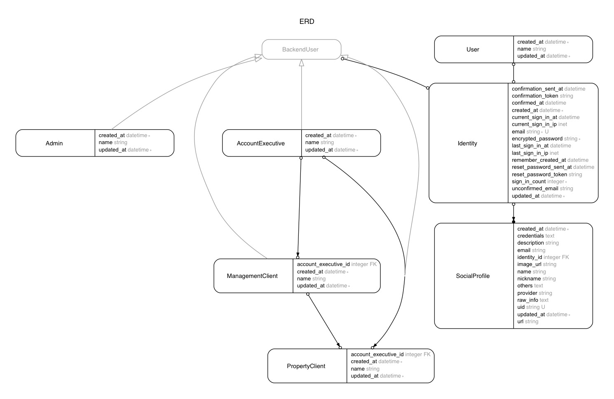

# Polymorphic Devise

## Features

- Has a central database table for all the registration info.
- Has two groups of users: general users and backend users.
- Backend users can be of any class. (Admin, Client, etc)

## Models

